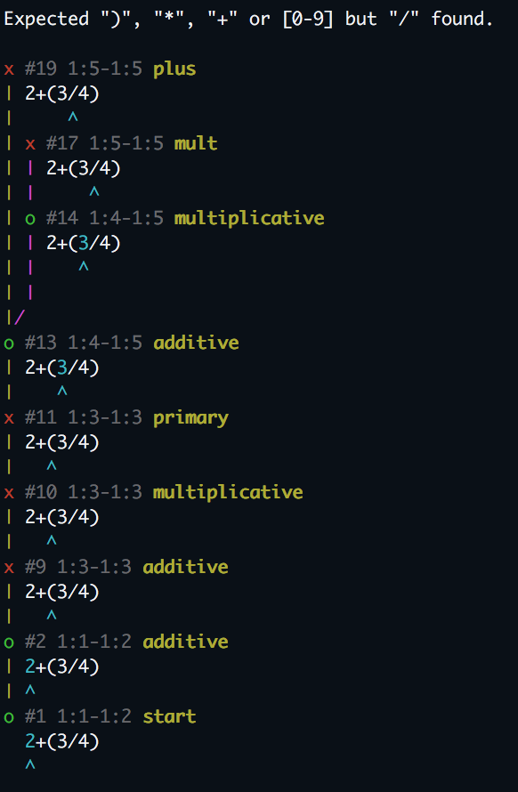
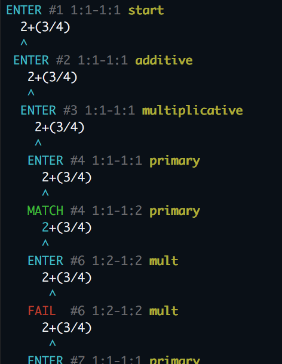
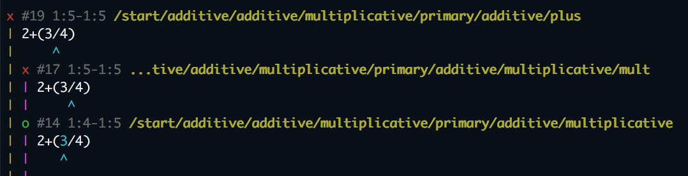

# pegjs-backtrace [](https://badge.fury.io/js/pegjs-backtrace)


A tracer module for [PEG.js](http://pegjs.org/) which generates a visual backtrace tree.

This module also supports normal tracing output. See [showTrace](#showTrace) option for detail.

# Example

The following example grammar recognizes arithmetic expressions like `2*(3+4)`.

```pegjs
start = additive

additive = multiplicative plus additive / multiplicative

multiplicative = primary mult multiplicative / primary

primary = integer / "(" additive ")"

integer = digits:[0-9]+

plus = "+"

mult = "*"
```

If you give the `2*(3/4)` which the grammar does not recognize, pegjs-backtrace shows backtrace tree from the maximum failure positions to the start rule as follows.



# Install

```bash
npm install pegjs-backtrace
```

# Usage

pegjs-backtrace is implemented as a [Tracer](https://github.com/pegjs/pegjs/commit/da57118a43a904f753d44d407994cf0b36358adc). When calling the `parse` function, pass the pegjs-backtrace instance to the `tracer` option.
Then, after parser fails, you can obtain the backtrace string from `getBacktraceString()`.

```js
var Parser = require('./parser'); // parser generated by pegjs --trace
var Tracer = require('pegjs-backtrace');

var text = '2*(3/4)';
var tracer = new Tracer(text); // input text is required.

try {
  Parser.parse(text, { tracer:tracer });
} catch(e) {
  console.log(tracer.getBacktraceString());
}
```

Note that `--trace` option is required to generated parser.js with pegjs command. If the option is not supplied, tracer feature is disabled.

# Options

When creating pegjs-backtrace instance, you can provide some options as follows.

```js
var Tracer = require('pegjs-backtrace');
var tracer = new Tracer(text,{
  parent: null,
  hiddenPaths: [],
  useColor: true,
  showTrace: false,
  maxSourceLines: 6,
  maxPathLength: 72,
  matchesNode: function(node, options) { return true; },
});
```

## parent

This option specifies a parent Tracer instance. Once the option is given, the parent's `trace` method is also called during parsing. The default value is `null`.

```js
var Parser = require('./parser');
var Tracer = require('pegjs-backtrace');
var tracer = new Tracer(text,{
  parent: new Parser.DefaultTracer(),
});
```

## useColor

If true, the output is colored with ANSI escape sequence. Otherwise no escape sequence is used. The default value is `true`.

## showSource

If true, quoted source are shown on the trace nodes. Otherwise source is suppressed. The default value is `true`.

## maxSourceLines

The maximum number of lines shown as the quoted source on each trace node. The default value is `6`.

## <a name="showTrace"></a>showTrace

If true, trace log is printed while parsing. The default value is `false`.



## showFullPath

If the options is true, the rule path is shown instead of the rule name. The default value is `false`.



## maxPathLength

The limit length of the displaying path name. When the path length exeeds to the limit, the path is truncated.

## hiddenPaths

This option specifies path patterns to hide. Any node that matches one of these patterns will be hidden from the trace log.
**Note that this option works only with trace log, not for backtrace.** The default value is `[]`.

```js
var Tracer = require('pegjs-backtrace');
var tracer = new Tracer(text,{
  hiddenPaths:["integer", "primary/.*"]
});
```

The type of the pattern must be `string` or `RegExp`. Even the pattern is `string`, it may also contain RegExp meta characters.

The `/` character can be used to represent the hierarchcal path of grammar rules. If the pattern is string like `"FOO"`, it is treated as the regular expression `/(^|\/)FOO(\/|$)/`.

## matchesNode

Custom filtering of nodes printed by the graph.

Two parameters are passed, `node` and `options`.

The `node` object is an internal representation which **may be subject to changes**.

The `options` are the options passed to `getParseTreeString()` or
`getBacktraceString()`.

`{ backtrace: false }` is passed when calling `getParseTreeString()`.

`{ backtrace: true }` is apssed when calling `getBacktraceString()`.

```js
{
  // example of showing only fail nodes when
  matchesNode: function(node) {
    if (node.type === "rule.fail") {
      return true;
    } else {
      return false;
    }
  }
}
```

# Limitation

The cursor symbol `^` may points the wrong position if the prefix of the source line contains East Asian full-width Characters.

The generating tree is based on the observable trace events from the pegjs parser. Any local failure inside a grammar rule is ignored. For example, if parser fails while
reading `"+"` character in the following `additive` rule, we can observe the event that `additive` fails but cannot get any information of `"+"` fails.

```pegjs
additive = multiplicative "+" additive / multiplicative
```

If you would like to see the event on `"+"` failure, the `"+"` should be an explicit rule like:

```pegjs
plus = "+"
additive = multiplicative plus additive / multiplicative
```
